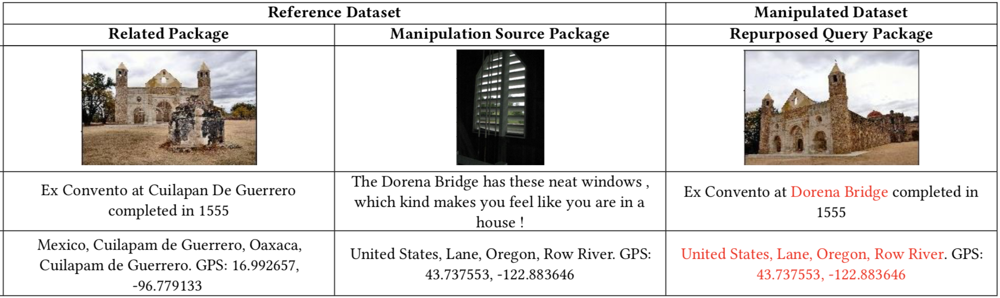

# MEIR - Multimodal Entity Image Repurposing

This repository releases dataset for paper:  
**[Deep Multimodal Image-Repurposing Detection](https://arxiv.org/abs/1808.06686)**  
presented at [ACM Multimedia 2018](http://www.acmmm.org/2018/) (orals)  

It also includes code for the multitask model in paper.

## Dataset

The dataset comprises following files:  
reference_dataset.json  
manipulated_dataset.json  
reference_id.txt  
manipulated_{train, dev, test}_id.txt  
manipulation_log.json  
manipulation_target_dictionary.json  
manipulation_source_dictionary.json  

Format for some files are give below according to the following example shown in paper:



### Reference dataset:

reference_dataset.json  
A dictionary containing reference packages.  
Format: {cluster_id: {filename: [[caption], location_name, GPS (latitude), GPS (longitude), timestamp]}}  
Example:  
```
{'16.99_-96.78_Mexico_Cuilapam de Guerrero_Oaxaca_Cuilapam de Guerrero':
{u'4291697125_74a6ebe27c_o.jpg': [[u'Ex Convento at Cuilapan De Guerrero completed in 1555'],
  u'Mexico_Cuilapam de Guerrero_Oaxaca_Cuilapam de Guerrero',
  u'16.992657',
  u'-96.779133',
  u'2000-01-03 00:36:48'],
 u'4291699055_925a73a9d2_o.jpg': [[u'Ex Convento at Cuilapan De Guerrero completed in 1555'],
  u'Mexico_Cuilapam de Guerrero_Oaxaca_Cuilapam de Guerrero',
  u'16.992657',
  u'-96.779133',
  u'2000-01-03 00:42:50']}
}
```

reference_id.txt  
A text file containing image filenames in the reference dataset  
Format: Image Filename  
Example:  
```
4291699055_925a73a9d2_o.jpg
```

manipulation_source_dictionary.json  
A dictionary annotating entities in each package.  
Format: {cluster_id: {filename: { Location, [GPS (latitude), GPS (longitude)], [Location entity list], [Organization entity list], [Person entity list]}}}  
Example:  
```
{'16.99_-96.78_Mexico_Cuilapam de Guerrero_Oaxaca_Cuilapam de Guerrero':
{u'4291697125_74a6ebe27c_o.jpg': {u'combined_location_name': u'Mexico_Cuilapam de Guerrero_Oaxaca_Cuilapam de Guerrero',
  u'lat_long': [u'16.992657', u'-96.779133'],
  u'location': [u'Cuilapan De Guerrero'],
  u'organization': [],
  u'person': []},
 u'4291699055_925a73a9d2_o.jpg': {u'combined_location_name': u'Mexico_Cuilapam de Guerrero_Oaxaca_Cuilapam de Guerrero',
  u'lat_long': [u'16.992657', u'-96.779133'],
  u'location': [u'Cuilapan De Guerrero'],
  u'organization': [],
  u'person': []},
 u'4292431182_f8c7641d76_o.jpg': {u'combined_location_name': u'Mexico_Cuilapam de Guerrero_Oaxaca_Cuilapam de Guerrero',
  u'lat_long': [u'16.992657', u'-96.779133'],
  u'location': [u'Cuilapan De Guerrero'],
  u'organization': [],
  u'person': []}}
}
```

### Manipulated Dataset

manipulated_dataset.json  
A dictionary containing potentially manipulated packages for train, validation and test splits.  
Format: {cluster_id: {filename: [[caption], location_name, GPS (latitude), GPS (longitude), timestamp]}}  
Example:  
```
{'16.99_-96.78_Mexico_Cuilapam de Guerrero_Oaxaca_Cuilapam de Guerrero':
{u'4291688511_eed9cf4f82_o.jpg': [[u'Ex Convento at Dorena Bridge completed in 1555'],
  u'United States_Lane_Oregon_Row River',
  u'43.737553',
  u'-122.883646',
  u'2000-01-02 23:51:23']}
}
```

manipulation_log.json  
A dictionary containing ground truth for packages in manipulated_dataset.json.  
Format: {cluster_id: {filename: {Package manipulation T/F, [[List of swapped entities]], manipulation source cluster, manipulation source file, manipulation type}}}  
Example:  
```
{'16.99_-96.78_Mexico_Cuilapam de Guerrero_Oaxaca_Cuilapam de Guerrero':
{u'4291688511_eed9cf4f82_o.jpg': {u'manipulated': True,
  u'manipulation_mapping': [[u'Cuilapan De Guerrero', u'Dorena Bridge']],
  u'manipulation_source_cluster': u'43.74_-122.88_United States_Lane_Oregon_Row River',
  u'manipulation_source_file': u'137211517_8ea1c80769_o.jpg',
  u'manipulation_type': u'LOCATION'},
 u'4291693909_e90d55fbfe_o.jpg': {u'manipulated': True,
  u'manipulation_mapping': [[u'Cuilapan De Guerrero', u'Verbier']],
  u'manipulation_source_cluster': u'46.08_7.28_Switzerland_Conthey_Canton of Valais_Alpe de Tortin',
  u'manipulation_source_file': u'5577522165_dc7d6dd7c6_o.jpg',
  u'manipulation_type': u'LOCATION'}}
}
```

manipulation_target_dictionary.json  
A dictionary containing entities in packages.  
Format: {cluster_id: {filename: { Location, [GPS (latitude), GPS (longitude)], [Location entity list], [Organization entity list], [Person entity list]}}}  
Example:  
```
{'16.99_-96.78_Mexico_Cuilapam de Guerrero_Oaxaca_Cuilapam de Guerrero':
{u'4291688511_eed9cf4f82_o.jpg': {u'combined_location_name': u'Mexico_Cuilapam de Guerrero_Oaxaca_Cuilapam de Guerrero',
  u'lat_long': [u'16.992657', u'-96.779133'],
  u'location': [u'Cuilapan De Guerrero'],
  u'organization': [],
  u'person': []},
 u'4291693909_e90d55fbfe_o.jpg': {u'combined_location_name': u'Mexico_Cuilapam de Guerrero_Oaxaca_Cuilapam de Guerrero',
  u'lat_long': [u'16.992657', u'-96.779133'],
  u'location': [u'Cuilapan De Guerrero'],
  u'organization': [],
  u'person': []}}
}
```

manipulated_{train, dev, test}_id.txt  
Text files containing image filenames for potentially manipulated packages.  
Format: Image Filename  
Example:  
```
4291688511_eed9cf4f82_o.jpg
```

## Requirements

### Feature Vectors

Image feature extraction is left to the user. We used the pretrained model [here](https://github.com/ryankiros/visual-semantic-embedding).  
Image features should be prepared as 2-D matrix [image number x image feature dim], separately for reference, train, validation and test images.  
The ordering of images is expected to be same as that in text files.  

Word2Vec feature extraction code is included in repository, which requires Google's pretrained model from [here](http://mccormickml.com/2016/04/12/googles-pretrained-word2vec-model-in-python/).  

Location features extraction is provided.

### Code

The code is written in python with keras library (tensorflow backend) and has been tested with:  
Python 2.7  
Keras 2.1.4   
Tensorflow 1.4.1  